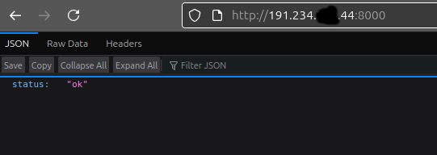

#  Tutorial CI/CD com Azure VM + FastAPI + Docker (para iniciantes)

## **Capítulo 1: Deploy manual de API FastAPI com Docker em VM da Azure**

Este tutorial ensina **como criar uma API com FastAPI** e **hospedá-la gratuitamente** em uma **máquina virtual (VM) da Azure** usando o Free Tier.

---

##  Visão Geral

- **Backend:** FastAPI (Python)
- **Deploy:** Azure VM (B1s, grátis)
- **Containerização:** Docker + Docker Compose
- **CI/CD:** GitHub Actions
- **Monitoramento:** script externo (em uma VPS)

---

##  Etapas

### 1. Criar Conta na Azure e Ativar o Free Tier

- Acesse: https://azure.microsoft.com/free
- Crie uma conta com e-mail educacional
- Ganhe **100 USD** em créditos + acesso a serviços gratuitos por 12 meses
[Veja aqui os créditos gratuitos do Azure](assets/azure-credits.png)

---

### 2. Criar uma VM Linux B1s

- Vá em **Free Services > Linux Virtual Machine**
- Clique em **Create**

**Configure assim:**

- **Authentication:** SSH public key
- **Username:** `azureuser`
- **SSH key:** Gerar nova key pair (guarde o arquivo `.pem` com segurança)
- **Tipo de VM:** B1s (marcado como “Free tier eligible”)
- **Portas abertas:** Marque apenas **porta 22 (SSH)** por enquanto

Finalize clicando em **Review + Create → Create**

---

### 3. Conectar à VM via Terminal (SSH)

1. Dê permissão ao arquivo `.pem`:
```bash
chmod 400 ~/Downloads/azureb1s-standard.pem
```
2. Acesse a VM:
```bash
ssh -i ~/Downloads/azureb1s-standard.pem azureuser@<IP_PUBLICO>
```

---

### 4. Instalar Docker + Docker Compose na VM

```bash
sudo apt update -y && sudo apt upgrade -y
curl -fsSL https://get.docker.com | sudo sh
sudo apt install docker-compose -y
sudo usermod -aG docker $USER
```
> ⚠️ Deslogue e logue novamente no SSH para aplicar o grupo docker e não precisar
usar docker com sudo

---

### 5. Configurar acesso SSH ao GitHub (recomendado)

#### A. Gerar chave SSH
```bash
ssh-keygen -t ed25519 -C "azure@ci-cd-tutorial"
```
Aperte Enter para todos os prompts (pode ser sem senha, se quiser). 

#### B. Copiar chave pública
```bash
cat ~/.ssh/id_ed25519.pub
```
Copie o conteúdo que começa com `ssh-ed25519`...

#### C. Adicionar no GitHub
- Vá em [https://github.com/settings/ssh/new](https://github.com/settings/ssh/new)
- Title: `Azure VM`
- Key: cole sua chave pública
- Clique em **Add SSH key**

#### D. Testar conexão:
```bash
ssh -T git@github.com
```

Talvez você seja notificado com uma mensagem 'The authenticity of host 'github.com (XX.201.28.YYY)' can't be established.'.

Digite yes 

Você verá:
```
Hi 92username! You've successfully authenticated...
```

---

### 6. Clonar seu Projeto FastAPI + Docker

```bash
git clone git@github.com:92username/CI-CD-tutorial-completo.git
cd CI-CD-tutorial-completo
docker compose up -d
```


---

### 7. Liberar a Porta 8000 na Azure (Acesso HTTP)


#### Opção A – Manual (GUI via portal):
- Vá até **Networking** da VM no portal Azure
- Clique em **Add Inbound Port Rule**
- **Source:** Any
- **Source port ranges:** `*`
- **Destination:** Any
- **Service:** `Custom`
- **Destination port ranges:** `8000`
- **Protocol:** TCP
- **Action:** Allow
- **Priority:** 310 
- **Name:** `AllowAnyCustom8000Inbound`
- Clique em **Add**

Sua API agora roda no container e estará acessível pela porta `8000`.

---

### 8. Testar se a API está online

Abra o navegador e acesse:

```
http://<SEU_ENDERECO_PUBLICO>:8000/
```

Se tudo estiver funcionando corretamente, você verá:
```json
{
  "status": "ok"
}
```

ou



Você também pode usar `curl` no terminal:
```bash
curl http://<SEU_ENDERECO_PUBLICO>:8000/
```

---

###  Pronto!
Você agora tem:

- Uma VM gratuita na Azure com sua API FastAPI rodando
- Docker instalado e configurado
- Projeto pronto para CI/CD com autenticação SSH no GitHub
- Porta 8000 liberada para acesso externo

##  Continuação

Você concluiu o **Capítulo 1: Deploy manual de API FastAPI com Docker em VM da Azure**.

 No **Capítulo 2**, vamos configurar o **deploy automático com GitHub Actions**, conectando seu repositório à infraestrutura da Azure.
